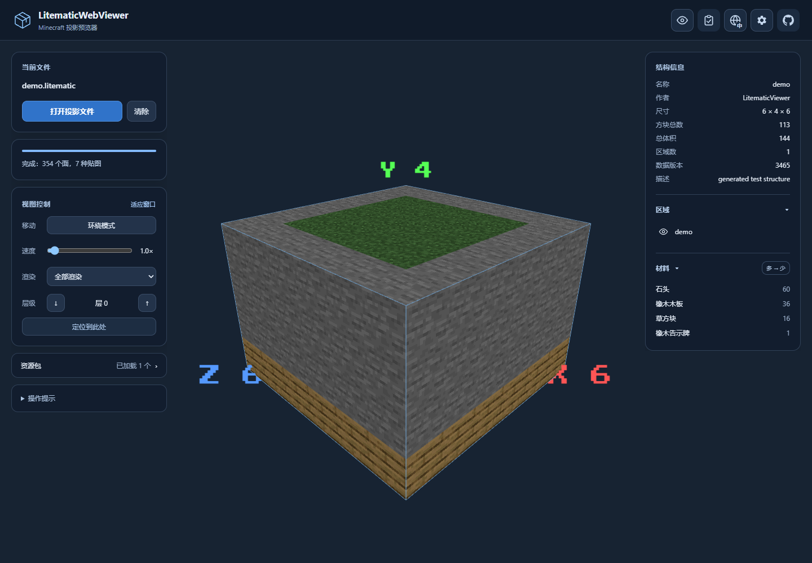
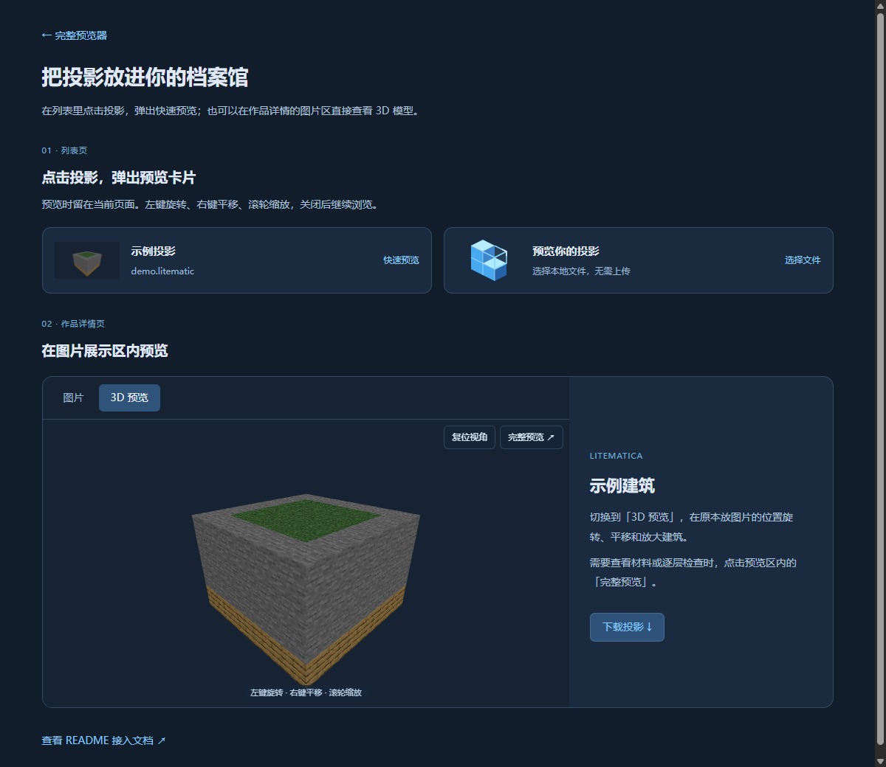
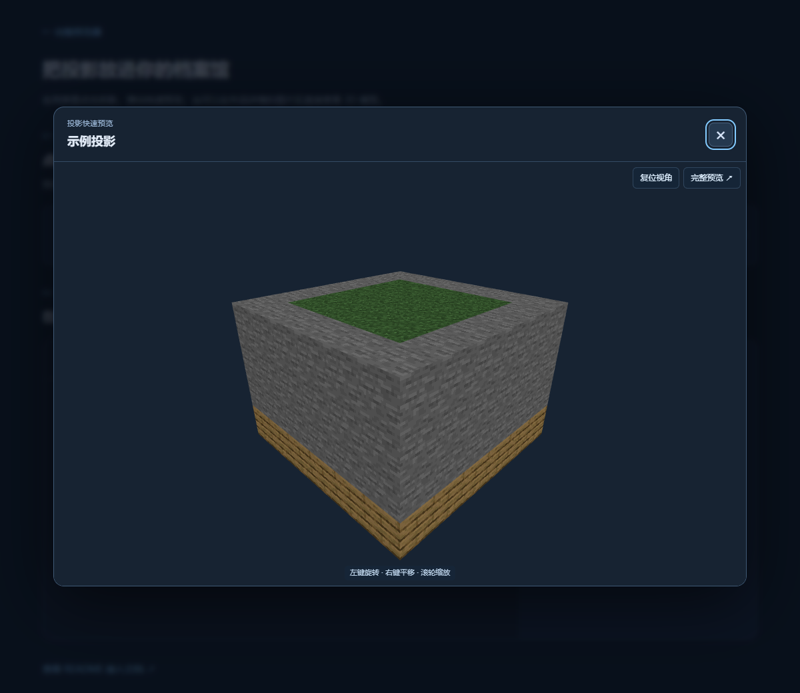
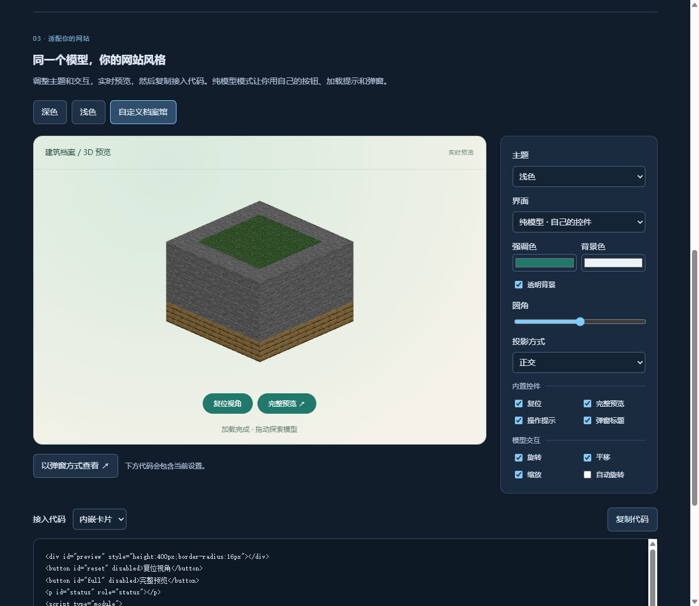
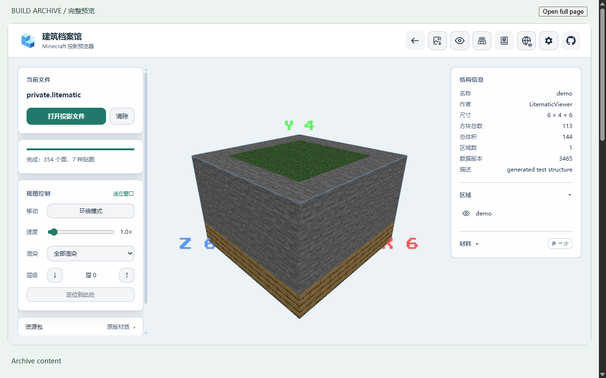
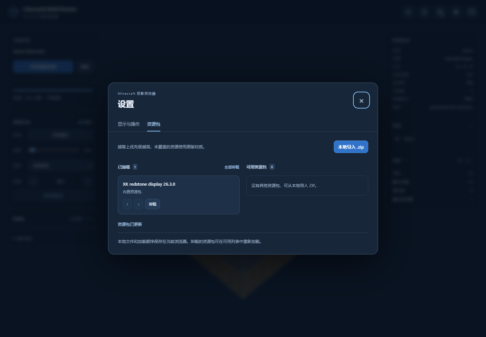
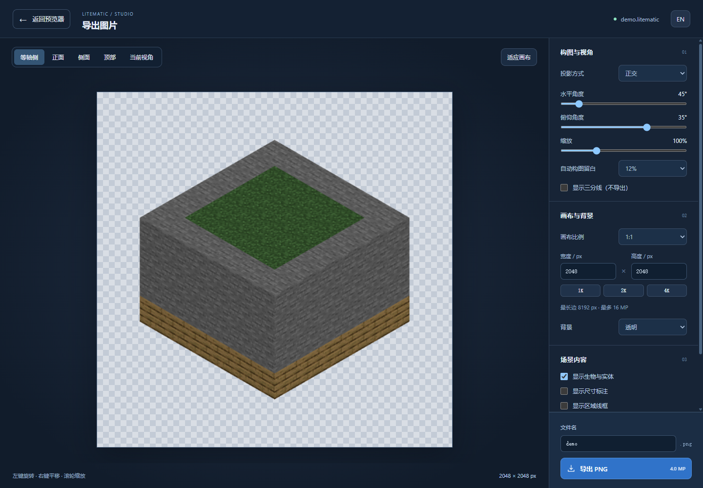
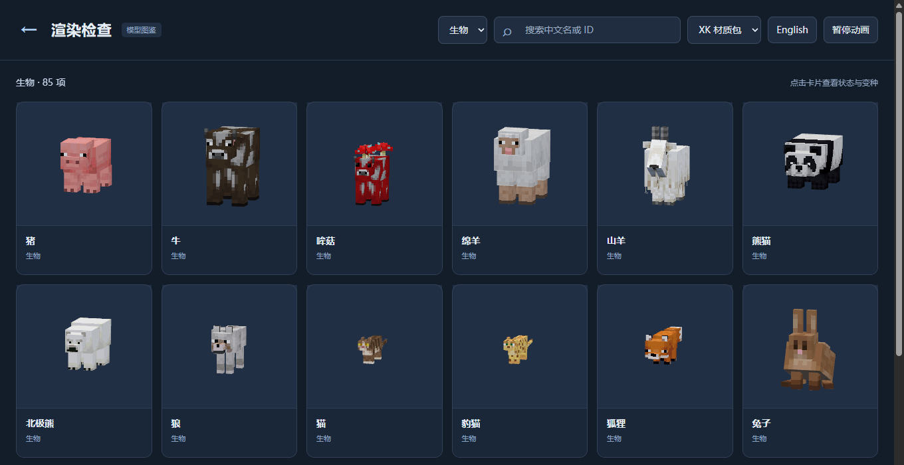
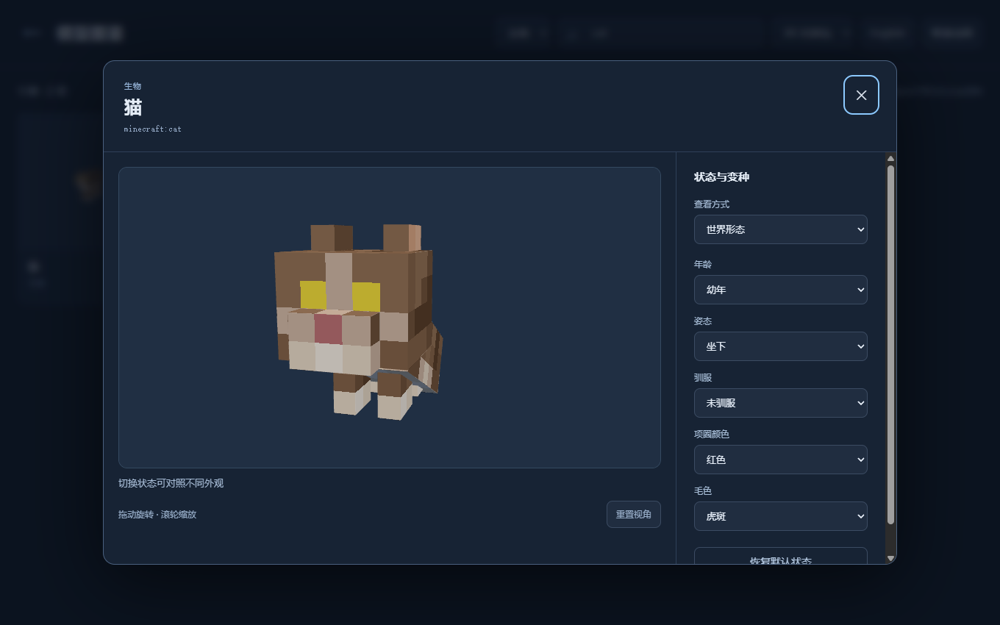
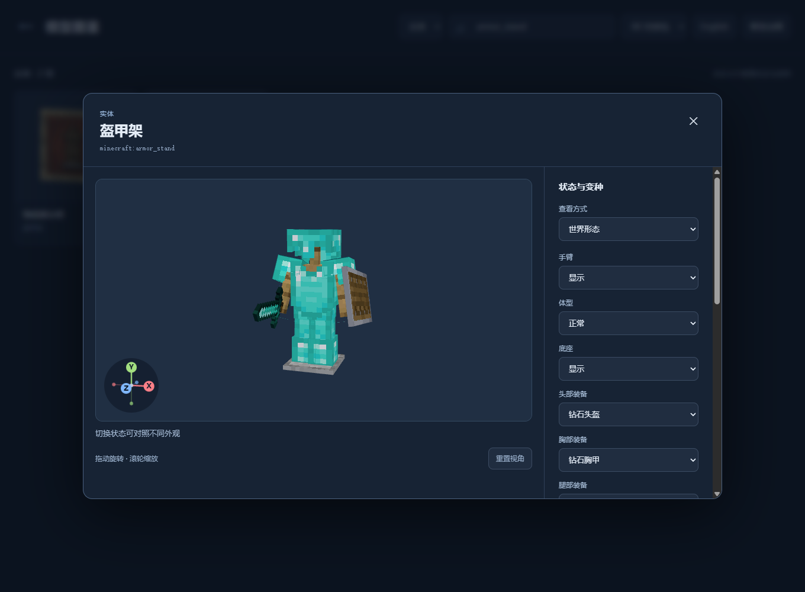

<p align="center"></p>

# LitematicWebViewer

**简体中文** · [English](README.en.md)

在浏览器里 3D 预览 Minecraft 的 `.litematic` / `.litematica` 投影文件（Litematica 模组保存的建筑蓝图），也可以通过模型图鉴页查看方块、生物和实体的不同状态。纯前端运行，不需要后端服务器。代码主要由 AI 完成。

**[在线预览器](https://lwv.loafing.club/)** · **[模型图鉴](https://lwv.loafing.club/scripts/entity-preview.html)** · **[预览卡片示例](https://lwv.loafing.club/embed-example.html)** · **[下载示例文件](samples/demo.litematic)**



*打开投影后，可以旋转、缩放建筑，查看材料清单，或切换层级检查内部结构。图中使用仓库自带的 `demo.litematic`。*

## 功能

**渲染**

- **真实贴图**渲染，支持加载 **资源包（.zip）** 更换方块贴图
- 完整方块模型（楼梯、栅栏、门、红石线/元件、铁轨等），隐藏面剔除、按贴图合并
- 草 / 树叶 / 水 / 岩浆染色；水与岩浆半透明渲染，并复刻原版的水下雾、水面流向、气泡柱
- 特殊方块：钟、附魔台书本、潮涌核心、动态末地传送门 / 折跃门、飘动旗帜、陶罐（陶片图案）、雕文书架、铜傀儡雕像等
- 实体渲染：矿车、船、坐垫、告示牌文字、玩家头颅（真实皮肤）、物品展示框
- 乘客渲染：读取投影中嵌套的 `Passengers`，显示生物乘坐矿车、船 / 竹筏和坐垫；支持双人船、幼年乘客、乘坐姿势与装备联动
- Minecraft 26.3 的 90 种生物：持续特效、骨骼待机动画，以及皮肤、羊毛、膨胀、坐姿等状态；其中 42 种支持幼年形态
- 支持鹦鹉螺及僵尸鹦鹉螺的鞍具/护甲、珊瑚变种、骆驼尸壳、焦骸和硫方怪的透明内外层及吞入方块
- 方块状态包含悬挂式告示牌多轴旋转、铜傀儡雕像四种姿势、讲台书本，以及按方块实体 NBT 还原的移动活塞
- 原版动画贴图帧表与插值；资源包可覆盖动画，例如内置 XK 的水贴图为单帧

**交互**

- 环绕 / 飞行两种相机模式，可随时切换
- 透视 / 正交渲染切换，默认透视；正交视图便于比较尺寸和查看结构
- 图片导出工作台：等轴侧视角、透明 PNG、自定义分辨率和画布比例，沿用当前投影、资源包与层级选择
- 区域显示 / 隐藏、层级切片渲染（全部 / 下方 / 上方 / 单层）
- 材料清单：按方块统计数量、中文译名、多 ↔ 少排序
- 中 / 英双语界面
- 模型图鉴：分类、双语搜索、状态组合，以及世界 / 物品 / 刷怪蛋 / 展示框视图
- 设置面板：背景色、显示实体 / 区域线框 / 尺寸、水下雾、镜头灵敏度
- 移动端适配：飞行模式下左下角虚拟摇杆移动、右下角上升 / 下降按钮
- 可嵌入其他网站的投影预览：弹窗或内嵌卡片，支持主题定制、透明背景、纯模型模式和宿主控制接口；提供可复制代码的[样式定制器](https://lwv.loafing.club/embed-example.html#customize)
- 完整预览器嵌入：档案馆品牌、面板与工具显隐、紧凑布局，快速卡片跳转后保留主题

日常使用直接打开[在线预览器](https://lwv.loafing.club/)即可；以下安装步骤适合本地运行或开发。

## 嵌入预览卡片

投影档案馆、作品详情页等网站可以直接嵌入本站的渲染卡片，不需要部署渲染器或上传投影到本站。[查看可操作示例](https://lwv.loafing.club/embed-example.html)。



支持两种展示方式：**点击列表中的投影，在当前网页弹出预览卡片**；或**在作品详情页的图片区域嵌入 3D 预览**。两者都支持左键拖动旋转、右键拖动平移、滚轮缩放；手机单指旋转、双指平移和缩放，在预览区域外滑动可滚动网页。右上角提供“复位视角”和“完整预览”，只有点击后者才在新标签页进入完整网站。快速预览不启用 WASD 飞行。

### 方式一：点击投影弹出卡片

把档案馆原有的投影列表项、缩略图或“快速预览”按钮接入 `openLitematicPreview`。用户留在当前页面，关闭卡片即可继续浏览。

```html
<button id="preview-schematic" type="button">预览示例投影</button>

<script type="module">
  import { openLitematicPreview } from 'https://lwv.loafing.club/embed.js'

  document.getElementById('preview-schematic').addEventListener('click', () => {
    openLitematicPreview({
      url: 'https://lwv.loafing.club/demo.litematic',
      name: '示例投影',
      lang: 'zh',
      pack: 'xk',
    })
  })
</script>
```



点击关闭按钮、遮罩或按 Esc 退出；关闭后释放渲染资源，并恢复原页面的滚动和焦点。每次只打开一个弹窗，新弹窗会替换旧弹窗。样式放在 Shadow DOM 内，不影响宿主网站。

`openLitematicPreview(options)` 与下文卡片 API 共用文件、主题、交互和回调选项，返回 `element`、`load(source, name?)`、`setOptions()`、`setCamera()`、`resetView()`、`openFullViewer()` 和 `close()`。可用 `file` 代替 `url`，或先打开弹窗，再调用 `load` 传入取得的文件；离开 SPA 路由时调用 `close()`。`name` 设置弹窗标题。公开文件 URL 需要满足下文的 CORS 要求。

### 方式二：在详情页图片区域嵌入

将以下 iframe 放进作品详情页原有的图片区，就能在该区域旋转、平移和缩放投影。也可以像[示例详情页](https://lwv.loafing.club/embed-example.html#detail)一样添加“图片 / 3D 预览”切换：选中 3D 时调用下文的 `createLitematicCard`，切回图片时调用 `destroy()` 释放资源。

下面这段可以直接运行。替换 `file` 参数时，请对**整个文件 URL** 使用 `encodeURIComponent` 或 `URLSearchParams` 编码，不要直接拼接含 `&` 的下载链接。

```html
<iframe
  src="https://lwv.loafing.club/embed.html?file=https%3A%2F%2Flwv.loafing.club%2Fdemo.litematic&amp;lang=zh&amp;pack=xk"
  title="投影预览"
  loading="lazy"
  referrerpolicy="no-referrer"
  sandbox="allow-scripts allow-same-origin allow-popups allow-popups-to-escape-sandbox"
  style="width:100%;height:320px;border:0;border-radius:12px"
></iframe>
```

| URL 参数 | 含义 | 默认值 |
| --- | --- | --- |
| `file` | `.litematic`、`.litematica` 或 `.nbt` 的直接下载地址；不是下载介绍页 | 无，等待文件 |
| `lang` | `zh` / `en` | `zh` |
| `pack` | `xk` / `vanilla` | `xk` |
| `background` | 六位十六进制背景色，例如 `%23172332`，或 `transparent` | 跟随主题 |
| `theme` | `dark` / `light` / `auto`（跟随系统） | `dark` |
| `ui` | `default` / `none`；后者隐藏内部界面 | `default` |

**跨域要求：**文件服务器必须允许 `https://lwv.loafing.club` 读取响应，例如返回 `Access-Control-Allow-Origin: https://lwv.loafing.club`；公开文件也可以返回 `*`。有重定向时，下载链路也需要满足 CORS。文件请求不携带 Cookie 或认证信息。线上使用 HTTPS，HTTP 仅用于本地 HTTP 开发环境。[CORS 说明](https://developer.mozilla.org/en-US/docs/Web/HTTP/Guides/CORS)

### 文件来源：JS 接入与需要登录的下载

弹窗和内嵌卡片都可以使用文件数据。需要登录才能下载、没有开放跨域接口，或者已经在档案馆页面取得文件时，宿主网站按自己的权限读取文件，再把 `File` / `Blob` / `ArrayBuffer` / 类型化数组交给预览，不需要把登录凭据传给本站。下面以内嵌卡片为例；弹窗可使用 `openLitematicPreview({ file, name: file.name })`。

```html
<input id="schematic" type="file" accept=".litematic,.litematica,.nbt">
<div id="preview-card" style="height:320px;border-radius:12px"></div>

<script type="module">
  import { createLitematicCard } from 'https://lwv.loafing.club/embed.js'

  const card = createLitematicCard(document.getElementById('preview-card'), {
    lang: 'zh',
    pack: 'xk',
    onStatus(event) {
      if (event.type === 'error') console.error(event.message)
    },
  })

  document.getElementById('schematic').addEventListener('change', event => {
    const file = event.target.files[0]
    if (file) card.load(file)
  })

  // 档案馆已有的下载接口也可以这样接入：
  // const response = await fetch('/api/schematics/123/download', {
  //   credentials: 'same-origin',
  // })
  // if (!response.ok) throw new Error(`HTTP ${response.status}`)
  // card.load(await response.blob(), '建筑名称.litematic')

  // SPA 路由切换或删除卡片时调用：
  // card.destroy()
</script>
```

也可以创建时直接传入 `file`，或使用 `{ url: 'https://档案馆/建筑.litematic' }`。URL 模式仍受上一节的 CORS 限制；宿主读取文件也必须具有正常访问权限，此接口不会绕过登录或跨域限制。

`createLitematicCard(container, options)` 中，`name` 用于无障碍标题及未命名文件的默认名称，`poster` 指定等待激活时的 HTTP(S) 封面图片。返回值包含 `element`、`load(source, name?)`、`setOptions()`、`setCamera()`、`resetView()`、`openFullViewer()` 和 `destroy()`。`load` 对无效类型、空文件和超限文件会同步抛错，网络或解析失败通过 `onStatus` 报告。

### 适配网站风格与纯模型模式

[打开样式定制器](https://lwv.loafing.club/embed-example.html#customize)，可以试用深色、浅色和自定义档案馆风格，调整参数并复制可运行的内嵌或弹窗代码。已有接入方式继续可用；默认仍是深色主题和完整的旋转、平移、缩放操作。



```js
const preview = openLitematicPreview({
  url: schematicURL,
  name: '建筑名称',
  theme: 'light',
  background: '#f2f5f8',
  style: { accent: '#21796b', radius: 16, fontFamily: 'system-ui, sans-serif' },
  controls: { hint: false },
  labels: { open: '查看材料与分层 ↗', reset: '复位' },
  dialog: { width: 960, height: 680 },
  camera: { projection: 'orthographic' },
  interaction: { autoRotate: true, autoRotateSpeed: 2 },
});
// 用户切换网站主题时，无需重新下载或生成模型：
preview.setOptions({ theme: 'dark', background: null });
```

| 选项 | 可用值与作用 |
| --- | --- |
| `theme` | `dark`、`light`、`auto`；`auto` 跟随操作系统，网站自己的主题开关可调用 `setOptions` |
| `background` | `#RRGGBB`、`transparent`、`null`（跟随主题）；透明模式的 WebGL 画布也透明，可叠在网站的图片或渐变上 |
| `style` | `accent`、`surface`、`text`、`muted`、`border`、`backdrop` 接受十六进制颜色；`background` 接受六位颜色；`radius` 为 0–48 像素；`fontFamily` 为字体列表（字体需在预览站点可用） |
| `ui` | `default` 保留内置界面；`none` 隐藏内部按钮、操作提示、加载及错误提示，交给宿主页面呈现 |
| `controls` | `reset`、`open`、`hint`、`status` 控制内部 UI；`title` 控制弹窗标题；均为布尔值，默认 `true`。弹窗关闭按钮始终保留 |
| `labels` | 可覆盖 `reset`、`open`、`hint`、`waiting`、`loading`、`error`、`retry`、`activate`、`subtitle`、`close`；全部按纯文本显示 |
| `dialog` | 弹窗 `width` / `height`，单位像素，范围 240–4096；自动限制在当前屏幕内 |
| `interaction` | `rotate`、`pan`、`zoom` 默认 `true`；`autoRotate` 默认 `false`；`autoRotateSpeed` 默认 2，范围 -20–20，负数反向 |
| `camera` | `projection: 'perspective' / 'orthographic'`，`zoom` 范围 0.01–100；可成对提供 `position: [x,y,z]`、`target: [x,y,z]`，单位为方块。正交相机快照还包含 `height` |

纯模型模式适合已有弹窗、工具栏和加载界面的档案馆。下面使用宿主自己的按钮；若需要弹窗，请把这些元素放进宿主自己的 `<dialog>` 或弹窗组件（定制器也会生成这种代码）。

```html
<div id="model" style="height:400px;background:linear-gradient(#d7eadd,#f5f2e9)"></div>
<button id="reset-model" disabled>复位视角</button>
<button id="open-model" disabled>完整预览</button>
<p id="model-status" role="status"></p>
<script type="module">
  import { createLitematicCard } from 'https://lwv.loafing.club/embed.js?v=customize-1';
  const reset = document.getElementById('reset-model');
  const open = document.getElementById('open-model');
  const preview = createLitematicCard(document.getElementById('model'), {
    url: 'https://lwv.loafing.club/demo.litematic',
    background: 'transparent', ui: 'none',
    camera: { projection: 'orthographic' },
    onStatus(event) {
      document.getElementById('model-status').textContent = event.message || '';
      if (event.stage !== 'handoff' && ['loaded', 'loading', 'error', 'inactive'].includes(event.type)) {
        reset.disabled = open.disabled = event.type !== 'loaded';
      }
      // loading 事件的 progress 是 0–1；未提供时可显示不定进度条。
    },
    onCameraChange(camera) { /* 可保存视角，之后传给 setCamera(camera) */ },
  });
  reset.onclick = () => preview.resetView();
  open.onclick = () => preview.openFullViewer();
  // 移除组件时：preview.destroy();
</script>
```

- `setOptions(patch)` 合并嵌套设置；分组设置为 `null` 可复位该组，`style` / `labels` 中单项设为 `null` 可移除覆盖。更改外观不会重置当前视角。`pack`、`poster` 是创建选项；更换文件使用 `load()`。
- `setCamera(patch)` 设置并保存初始视角；`resetView()` 回到配置的视角并适配模型。离屏释放并恢复 iframe 时，会保留最近视角与设置。
- `openFullViewer()` **直接在宿主按钮的点击回调内调用，不要先 `await`**，以保留浏览器允许打开新标签页的用户操作。成功打开返回 `true`；模型未完成、正在交接或窗口被阻止时返回 `false`。窗口打开后再传递文件和相机，不需要重新下载私有文件。
- 打开新窗口或文件交接失败的 `error` 带有 `stage: 'handoff'`，模型仍可操作，宿主应保留重试按钮。
- `onStatus(event)` / `preview-status` DOM 事件包含 `waiting`、`ready`（通信就绪）、`loading`、`loaded`、`error`、`inactive`（离屏释放）、`handoff-start`、`handoff-end`、`close-request`。纯模型模式或隐藏 `status` 时也会发送事件，宿主应显示加载失败信息。
- `onCameraChange(camera)` / `preview-camera` DOM 事件提供相机快照（最多约每 100ms 一次）；相机变化不会打断 `onStatus` 的加载状态。内嵌卡片按 Esc 发送 `close-request`，内置弹窗自动关闭；自建弹窗可据此处理关闭。

弹窗外框还支持 CSS 自定义属性和 `::part`，可统一匹配宿主的设计：

```css
[data-litematic-preview] {
  --lwv-dialog-width: 960px;
  --lwv-radius: 20px;
  --lwv-surface: #f7faf8;
  --lwv-backdrop: #14233488;
}
[data-litematic-preview]::part(header) { padding: 12px 20px; }
[data-litematic-preview]::part(title) { font-weight: 500; }
```

公开部件为 `dialog`、`header`、`title`、`subtitle`、`close-button`、`viewport`；其他变量有 `--lwv-dialog-height`、`--lwv-font`、`--lwv-text`、`--lwv-muted`、`--lwv-border`、`--lwv-accent`。**这些 CSS 只控制外框；iframe 内部通过 `style`、`controls`、`labels` 等配置控制。**宿主的字体文件和 CSS 不会自动进入跨域 iframe。

SDK 保持单文件 ES module 地址。采用新接口时建议使用定制器生成的带版本号导入地址，避免浏览器保留旧 SDK；示例页会自动匹配构建版本。开发时修改 `src/embedSdk.js` / `src/previewOptions.js`，`npm run build`（或 `npm run dev` 启动时）会生成 `public/embed.js`。

### 在档案馆内嵌入完整预览器

`createLitematicViewer` 把主界面的层级控制、区域开关、材料清单、资源包管理和图片导出直接放进作品页。它与快速卡片共用 `theme`、`background`、`style` 和相机配置，设置窗口与导出界面也会使用同一主题。



在[定制器](https://lwv.loafing.club/embed-example.html#customize)中将「预览模式」切换为「完整预览器」，可以试用面板布局、档案馆名称与返回按钮，并复制内嵌或弹窗代码。

```html
<div id="viewer" style="height:680px;border-radius:14px;overflow:hidden"></div>
<script type="module">
  import { createLitematicViewer } from 'https://lwv.loafing.club/embed.js?v=viewer-1';
  const viewer = createLitematicViewer(document.getElementById('viewer'), {
    url: 'https://lwv.loafing.club/demo.litematic', // 也可以传 file
    lang: 'zh', pack: 'xk', theme: 'light',
    style: { accent: '#21796b', surface: '#ffffff', radius: 14 },
    viewer: {
      header: true,
      layout: 'auto', density: 'comfortable', panelOpacity: 0.94,
      panels: { file: false, metadata: true, materials: true },
      tools: { catalog: false, help: false },
      expanded: { regions: true, materials: false },
      brand: {
        name: '我的建筑档案馆',
        // logo: 'https://archive.example/logo.svg',
        returnUrl: 'https://archive.example/build/123',
        returnLabel: '返回作品详情',
      },
    },
  });
  // 跟随档案馆自己的主题开关；不会重新加载模型或重置视角。
  // viewer.setOptions({ theme: 'dark', style: { surface: null } });
  // 离开作品页或移除组件时：viewer.destroy();
</script>
```

| `viewer` 配置 | 作用与默认值 |
| --- | --- |
| `header` | 显示标题栏，默认 `true`；关闭后渲染区延伸至顶部 |
| `layout` | `auto`：宽屏左右面板、窄屏底部抽屉；`compact`：宽屏也收起为底部按钮 |
| `density` / `panelOpacity` | `comfortable` 或 `compact`；面板不透明度范围 0.3–1，默认 0.94 |
| `panels` | `file`、`controls`（视角与层级）、`metadata`、`regions`、`materials`；默认全部显示 |
| `tools` | `packs`、`export`、`catalog`、`settings`、`language`、`help`（提示与源码链接）、`interface`（隐藏界面）、`projection`（正交/透视）；默认全部显示 |
| `expanded` | `regions`、`materials` 默认展开；修改主题不会覆盖用户手动展开/收起的状态 |
| `brand` | `name`、`logo`、`returnUrl`、`returnLabel`；文字按纯文本处理，链接需为绝对 HTTP(S) 地址。嵌入时返回链接在新标签打开，独立完整页在当前标签返回 |

返回对象与快速卡片相同，支持 `load`、`setOptions`、`setCamera`、`resetView`、`openFullViewer`、`destroy`，以及加载/相机事件。`ui`、`controls`、`labels` 定制快速卡片；完整界面的入口和面板使用上表的 `viewer` 配置。`interaction` 控制环绕交互，完整预览器仍提供飞行模式。完整界面中的普通操作错误会带 `stage: 'viewer'`，宿主可显示提示而保留已加载模型的操作按钮。

**快速卡片也可以传入 `viewer` 配置。**用户打开「完整预览」时，主题、字体、透明背景、面板和品牌设置会一起带过去。外观配置保留在完整页网址中，刷新仍可使用；文件数据模式的文件本身仍需重新打开。仅通过宿主 CSS 修改弹窗外框的样式不会自动传入完整页，应使用 `style` 配置。

完整预览器首次进入可视区域时加载，离屏或宿主预览弹窗打开时暂停绘制，保留文件、层级、资源包和视角，直到调用 `destroy()`；它不参与快速卡片的 `maxActive` 释放池。适合详情页或按需弹窗，列表缩略图继续使用快速卡片。嵌入会话及其打开的完整页面不读取或写入独立网站的个人偏好；在其中导入的资源包只保留在当前页面内存中。

### 多卡片、完整预览与部署

- **列表页推荐封面图片配合点击弹窗。**只在点击后启动 3D 渲染。若需要同时显示多张内嵌预览，JS 脚本默认最多挂载 2 张可见卡片，其他显示封面或“启用 3D 预览”；悬停或激活可切换运行的卡片。离屏卡片会移除 iframe，释放渲染上下文，回到视野时重新加载。打开弹窗也会释放后台内嵌卡片，关闭后恢复（正在向完整页面传递文件的卡片会临时保留）。可使用同一模块导出的 `configureLitematicCards({ maxActive: 1 })` 调整，范围为 1–4。原始 iframe 只会暂停离屏渲染，不参与 JS 的卡片管理。
- **打开“完整预览”会保留文件、相机位置、投影方式、语言、材质预设和外观配置。**透明背景也会保留；新标签页不会复制宿主页面背后的图片或渐变。文件通过经来源、窗口和随机标记校验的 `postMessage` 交接，不依赖第三方 Cookie 或浏览器存储，也不上传到服务器。请保持原页面和预览卡片打开直到加载完成，并允许用户单击打开新标签页。[postMessage 说明](https://developer.mozilla.org/en-US/docs/Web/API/Window/postMessage)
- **文件数据模式的完整页面刷新后需要重新打开文件。**公开 URL 模式保留 `file` 参数，可重新下载；临时签名链接过期后需由档案馆更新。
- 卡片及其打开的完整页面使用指定的 `xk` / `vanilla` 预设，不读取个人资源包，也不覆盖已有资源包偏好。自定义 ZIP 暂不作为嵌入参数提供。
- 嵌入文件上限为 **64 MiB（压缩文件大小）**，另受下文投影方块数量与浏览器内存限制。大型投影依然需要完整下载和解析，建议档案馆列表使用封面图片，详情页提供交互预览。
- 使用严格 CSP 的宿主需允许本站的 `frame-src`；JS 方式还需允许本站的模块脚本。若设置 iframe `sandbox`，保留示例中的四项权限；完整预览器还需要 `allow-downloads` 用于导出 PNG，SDK 会自动添加。
- 可在当前静态托管上运行，不需要后端代理。自建部署时从自己的域名引入 `embed.js`，脚本会自动找到同目录的 `embed.html` 或 `index.html`；相对路径也兼容子目录部署。托管响应不能用 `X-Frame-Options: DENY/SAMEORIGIN` 或限制性的 CSP `frame-ancestors` 阻止合作网站嵌入。

验证命令：

```bash
node scripts/verify-embed-protocol.mjs  # URL/文件校验、错误响应、流式下载上限
npm run build
node scripts/verify-embed.mjs           # 跨站交接、透明像素、主题/相机接口、生成代码、弹窗与鼠标/触摸操作
node scripts/verify-full-viewer.mjs     # 完整嵌入、面板/品牌、设置隔离、PNG 下载、跳转继承与手机布局
```

浏览器验证需要 Chrome / Chromium，使用独立的 5178 端口和临时测试页面。Windows 默认查找标准 Chrome 安装路径；其他安装位置可通过 `CHROME_PATH` 环境变量指定。

---

## 一、首次安装（只需做一次）

需要先安装 [Node.js](https://nodejs.org/) **22.12 或更高版本**。

打开命令行，进入本项目文件夹，依次执行：

```bash
npm install        # 安装依赖
npm run setup      # 下载官方客户端并提取贴图/模型，需要联网
```

> 默认资源版本为 **26.3**，首次运行会下载完整的 `client.jar` 并提取所需资源。也可以运行 `node scripts/fetch-assets.mjs 1.21.1` 指定其他版本；图鉴目录和新版实体模型仍以 26.3 为基准。

## 二、启动预览器

```bash
npm run dev
```

浏览器会自动打开 `http://localhost:5173`。

## 三、使用

1. 点击 **「打开投影文件」**，或者直接把 `.litematic` 文件**拖进网页**。首页还可直接进入 **「浏览模型图鉴」** 或 **「导出渲染图片」**。
2. 稍等片刻，建筑就会以 3D 形式显示出来。
3. 用左侧的 **「渲染」和「层级」** 控件查看全部、单层或指定层上下的结构；右侧可查看区域和材料清单。
4. 点右上角 **齿轮** 打开设置，**「显示与操作」**中可调整背景色、显示开关与镜头灵敏度，**「资源包」**中可管理材质；左侧资源包摘要也可直接打开对应设置。

资源包支持批量导入本地 ZIP、加载、卸载和上下排序，越靠上的包优先级越高，新导入的包放在最上方。卸载的本地包仍保留在可用列表，可随时重新加载；**「全部卸载」**恢复原版材质。文件和加载顺序保存在当前浏览器，刷新后恢复。切换资源包会保留当前视角、渲染层级和区域选择。



> 项目默认加载 [XK redstone display](https://modrinth.com/resourcepack/xk-redstone-display) 资源包，让红石粉显示 0–15 强度数字。

**操作方式**

- **环绕模式**（默认）：左键拖拽旋转 · 滚轮缩放 · 右键平移
- **飞行模式**（按 W/A/S/D 自动切换）：左键原地转头 · W/A/S/D 沿视线移动 · 右键平移 · 滚轮调速 · 空格 / Shift 升降
- **E / Q**：上一 / 下一层（配合左侧「渲染」下拉框的层级切片）
- **「定位到此处」按钮**：把当前层设为摄像机所在高度
- **「适应窗口」按钮**：重新居中建筑，自动给两侧面板留出空间
- 右上角：**图片下载** 导出图片 · **眼睛** 隐藏/显示界面 · **网格** 切换透视/正交渲染（高亮表示正交） · **方块图鉴** 在新标签页打开模型图鉴 · **地球** 切换语言 · **齿轮** 设置 · GitHub 链接
- **移动端**：底部“视图控制 / 结构信息”按需展开面板；飞行模式下左下角摇杆前后左右移动、右下角 ▲▼ 上升下降，单指划屏转头

### 导出 PNG 图片

点击右上角“隐藏界面”左侧的 **导出图片** 按钮，进入独立的导出工作台。已加载的投影会直接显示；没有投影时，可在工作台打开、拖入文件或体验示例。这个功能参考了 [Isometric Renders](https://github.com/gliscowo/isometric-renders) 的等轴侧渲染和透明图片导出用法。



- 默认正交等轴侧视角，可切换正面、侧面、顶部或预览器当前视角；支持透视、角度调整、旋转、平移和缩放。
- 选择画布比例、1K / 2K / 4K 预设或自定义宽高；“适应画布”和留白选项帮助完整容纳建筑。
- 默认导出透明背景，也可选纯色。棋盘格、三分线和界面控件只用于预览，不会出现在 PNG 中。
- 沿用当前资源包、渲染层级和可见区域；可独立控制实体、尺寸标注、区域线框及动画播放。动画默认暂停，导出的是当前单帧。
- 填写文件名，点击 **导出 PNG** 下载。返回预览器或按 Esc 退出后，原有视角和显示设置保持不变。

默认输出 2048 × 2048；最长边为 8192 px，总像素不超过 4096 × 4096，并受设备渲染上限约束。文件在浏览器中生成，无需上传。移动端可向下滚动调整设置和导出。

开发验证：`node scripts/verify-image-export-camera.mjs` 检查相机构图和尺寸边界；构建后运行 `node scripts/verify-image-export.mjs` 验证实际 PNG 下载、透明通道、4K 输出、交互、移动布局和返回时的状态恢复。

## 四、模型图鉴

无需加载投影文件，打开[在线模型图鉴页](https://lwv.loafing.club/scripts/entity-preview.html)即可浏览模型。本地运行时，点击预览器右上角带方块的图鉴按钮，也可以直接打开 `http://localhost:5173/scripts/entity-preview.html`。

支持“全部 / 方块 / 生物 / 实体”分类、中英文名称或 ID 搜索、分页、暂停动画和中英界面切换。顶部“设置”可加载、卸载、排序材质包，并导入本地 ZIP；越靠上的包优先级越高，未覆盖的资源回退原版。首次打开默认加载内置 XK，卸载全部材质包即可使用原版。导入文件、加载顺序和趣味选项保存在当前浏览器；语言和搜索条件仍保存在 URL 中，兼容旧链接的 `pack=xk` / `pack=vanilla`。

主界面设置的“显示与操作”和模型图鉴设置中均有“巨儒卫道士”开关，默认关闭；开启后，卫道士、唤魔者和幻术师同时显示交叉手臂与独立双臂。两处分别记住开关状态，主界面切换后立即更新当前投影中的生物。



*先选分类或输入名称，再点击卡片。图鉴涵盖 1,289 个方块资源条目（合并为 1,167 张卡片，含历史别名和展示框资源）、90 种生物，以及船、矿车、展示框、盔甲架和坐垫五类实体。26.3 实际注册的 1,286 个方块共 35,723 个状态均有几何有效性回归检查。*

### 在同一卡片中切换状态

| 检查对象 | 可以切换的内容 |
| --- | --- |
| 生物 | 皮肤、颜色、姿态、持续特效，以及适用生物的成年 / 幼年形态，例如普通 / 闪电苦力怕、幼猫坐姿 |
| 方块 | 原版方块状态，包括 505 种可含水方块、墙的“不显示 / 低 / 高”连接；门、床、双层植物默认完整显示 |
| 同类变种 | 蜡烛蛋糕归入蛋糕，挂墙告示牌 / 旗帜 / 头颅 / 火把 / 珊瑚扇归入对应卡片，炼药锅内容物和所有盆栽分别合并 |
| 船与其他实体 | 22 种木材与箱船组合、矿车类型、16 色坐垫及朝向、盔甲架手臂等；盔甲架默认隐藏手臂 |
| 生物乘坐 | 生物卡片可选择载具；普通矿车、船 / 竹筏和坐垫卡片可选择乘客及适用的幼年形态，普通船支持两位乘客，箱船支持一位；物品与展示框视图只显示物品本身 |
| 装备 | 盔甲架和适用生物的四个盔甲槽、主副手、惯用手、头部物品与鞘翅；马铠、狼铠、鞍具、羊驼地毯及快乐恶魂挽具；可组合染色、盔甲纹饰与附魔光效 |
| 物品与展示框 | 切换“查看方式”，检查对应物品、刷怪蛋或放入展示框后的样子；展示框卡片可筛选 1,658 种物品 |
| 特殊效果 | 水 / 岩浆的静止与八向流动、敲钟演示、附魔台翻书、潮涌核心激活与眼睛状态 |



*右侧下拉框可组合切换状态；左侧模型支持拖动旋转和滚轮缩放，左下角 XYZ 坐标轴随视角旋转，帮助判断朝向（X 东、Y 上、Z 南）。“查看方式”可切换物品 / 刷怪蛋和展示框视图。*

物品、刷怪蛋和幼年形态的可用性以原版为准；不可见方块或没有对应物品的对象会显示说明。若想对比水的逐帧动画，请切换原版材质：XK 的水贴图本身为单帧。

<details>
<summary>开发说明：资源来源、渲染对照与验证命令</summary>

方块选项合并资源包模型声明与 [26.3 游戏生成的状态报告（mcmeta 归档）](https://github.com/misode/mcmeta/blob/26.3-summary/blocks/data.json)，包含 505 种可含水方块（另兼容旧版 chain ID）以及墙的“不显示 / 低 / 高”连接状态。方块网格、流体与特殊方块实体共用主预览器的渲染路径。空气等不可见方块保留目录项并标明原因；图鉴页显示的是当前渲染器的能力，仍受下文已知外观差异的限制。

名称来自 Minecraft 26.3 官方 `zh_cn.json` 和 `en_us.json`。图鉴设置与主预览器独立；本地材质包通过 IndexedDB 保存，不上传服务器。更新默认资源版本后运行 `node scripts/gen-inspection-data.mjs <版本>`，重新生成目录、状态报告与官方译名。

坐垫按 26.3 的 [CushionModel](https://mc-packet-reference.netlify.app/26.x/source/net/minecraft/client/model/object/cushion/cushionmodel/) 和 [CushionRenderer](https://mc-packet-reference.netlify.app/26.x/source/net/minecraft/client/renderer/entity/cushionrenderer/) 渲染，读取实体 NBT 的 `color` 与朝向。图鉴将 16 色坐垫合并为一张实体卡片，可切换颜色、四个朝向，以及对应的物品和展示框视图；投影主预览器使用同一渲染实现。



装备按 26.3 的 [HumanoidArmorLayer](https://mc-packet-reference.netlify.app/26.x/source/net/minecraft/client/renderer/entity/layers/humanoidarmorlayer/)、`EquipmentLayerRenderer`、`ItemInHandLayer` 和动物专用模型实现。主预览器自动读取新版 `equipment`，同时兼容旧版 `ArmorItems`、`HandItems`、`ArmorItem`、`DecorItem` 和鞍具数据。图鉴中可逐槽选择装备；装备跟随骨骼姿态与待机动作，幼年生物使用新版专用盔甲模型，小型盔甲架保持原版缩放。手持物使用第三人称变换，三叉戟使用立体模型；皮革染色、狼铠损伤和盔甲纹饰读取物品组件及资源包。附魔光效使用原版贴图近似混合，目前用于穿戴装备。运行 `node scripts/gen-equipment-data.mjs --fetch` 可更新记录来源与 SHA-256 的模型数据和默认装备组件。

装备设置随当前穿戴物显示：皮革装备、皮革马铠和狼铠可染色；选中纹饰后才显示纹饰材质；狼铠损伤、附魔光效和惯用手也只在适用时出现。幼年动物隐藏无法渲染的身体装备与鞍具，猫和狼在驯服后才显示项圈颜色。移除适用装备会清除对应的预览设置，混搭时染色和纹饰只应用到适用槽位。

特殊方块对照 26.3 的 `BellModel`、`BannerRenderer`、`TheEndPortalRenderer`、`TheEndGatewayRenderer`、附魔台及潮涌核心渲染器。钟补全钟体，旗面绕横杆摆动，展示框旗帜遵循物品固定视角变换；末地传送门使用上下水平面，折跃门使用六面体，二者使用[官方末地传送门着色器](https://github.com/misode/mcmeta/blob/26.3-assets/assets/minecraft/shaders/core/rendertype_end_portal.fsh)的投影采样与分层星空。通用动画纹理支持 `.mcmeta` 的帧顺序、逐帧时长、帧尺寸和颜色插值，因此水、岩浆、火焰、下界传送门等贴图按原版帧表播放。图鉴页暂停按钮同时暂停贴图、方块和实体动画。

### 生物渲染对照记录

持续特效和待机姿态按原版 `EntityModel.setAngles`、动画关键帧及 `FeatureRenderer` 实现。参考基线是 [1.21.11 源码镜像的固定版本](https://github.com/duollectis/minecraft-decompiled-1.21.11/tree/b4cb28a04035b7a190aaf74d4b9ba5ed11095cbb/src/main/java/net/minecraft/client/render/entity)，保留项目已经对照 26.3 客户端转录的新版兔子模型和烈焰人火棒布局。默认贴图仍为 26.3，尚未完成两个版本之间全部实体模型差异的迁移。

| 对照项 | 当前处理 |
| --- | --- |
| 流动/发光图层 | 旋风人风层与眼睛、闪电苦力怕护盾、半血凋零护甲、监守者心跳/光斑、生物发光眼睛、发光鱿鱼、`jeb_` 彩虹羊毛 |
| 持续待机 | 烈焰人火棒、恶魂触手、鱿鱼触手、幻翼/蜜蜂/悦灵/恼鬼/蝙蝠翅膀、鱼尾和鱼鳍、守卫者棘刺/尾巴、炽足兽刚毛、蠹虫/末影螨摆动、双足生物手臂、猪灵耳朵、女巫鼻子、监守者呼吸、凋零躯干 |
| 状态相关待机 | 美西螈水陆待机、青蛙水中待机、骆驼待机及坐姿、铜傀儡转头、犰狳蜷缩、狐狸睡眠呼吸、鹦鹉/鸡滞空拍翅、潜影贝开盖摆动、末影龙翅膀和下颚 |
| 补齐外观 | 史莱姆内芯与半透明外壳、绵羊羊毛/底绒、热带鱼颜色/花纹、河豚三种体型、溺尸/流浪者/沼泽骷髅外层、村民服装、铁傀儡裂纹、驯服动物项圈、哞菇蘑菇、雪傀儡南瓜 |
| 修正模型和状态 | 洞穴蜘蛛/凋零骷髅/尸壳/猫/马/村民/灾厄村民比例、掠夺者空手/持弩双臂、船与竹筏的静止船桨、驴骡耳朵与箱子、羊驼箱子可见性、猫狼坐姿、狐狸睡姿、潜影贝头部/颜色/吸附方向、犰狳多余部件、山羊缺角、海龟蛋腹部 |

时间按每秒 20 tick 推进；从已保存 NBT 和结构中的水方块选择姿态。随机待机的起点使用稳定种子，无法还原存档中未保存的客户端动画相位。没有持续待机动作的生物保持原版静止姿态；不模拟 AI、移动、攻击、粒子、临时事件或末影龙的历史飞行轨迹。

监守者触角对照 26.3 的 [WardenModel](https://mc-packet-reference.netlify.app/26.x/source/net/minecraft/client/model/monster/warden/wardenmodel/) 与 [ModelPart.Cube](https://mc-packet-reference.netlify.app/26.x/source/net/minecraft/client/model/geom/modelpart/)：修正零厚度平面合并后横向 UV 翻转的问题，同步修正美西螈外鳃、翅膀、鱼鳍等共用部件。平面省略重合面和零面积侧面；膨胀后具有厚度的部件（如疣猪兽鬃毛）保留六面，并统一修正上下表面的法线方向。

幼年形态使用 26.3 的 27 套独立模型、专用贴图及美西螈/骆驼/犰狳待机关键帧；嗅探兽和快乐恶魂使用原版缩放规则，快乐恶魂保留幼体内芯。猫、狼、狐狸的幼年坐姿/睡姿也按新版模型处理。生成数据记录了[客户端源码镜像](https://mc-packet-reference.netlify.app/26.x/source/net/minecraft/client/model/animal/cow/babycowmodel/)的具体 URL 和 SHA-256；运行 `node scripts/gen-baby-models.mjs --fetch`、`node scripts/gen-baby-animations.mjs --fetch` 可重新获取并转录。

仍确认存在的差异：寒冷/温暖牛、猪、鸡等变种目前只切换贴图，未切换专用几何；村民帽子尚未读取资源包的 hat 元数据；狐狸叼物、熊猫进食等专用物品层、手持物附魔光效、自定义玩家头颅皮肤、拴绳及乘骑组合尚未完整渲染。手持物目前覆盖盔甲架、人形盔甲生物、掠夺者、悦灵和恼鬼，不模拟使用物品、攻击或拉弓过程。静态投影也不能复现游戏中的动态光照和实体之间的交互。图鉴页的敲钟、翻书和激活潮涌核心为显式演示选项；不模拟玩家靠近、潮涌核心框架检测、折跃门临时光束或粒子。

验证命令（需先执行 `npm run setup` 安装默认资源）：

```bash
node scripts/verify-entities.mjs  # 全部生物/状态、真实贴图、绑定姿态、动画无漂移、资源隔离及释放
node scripts/verify-entity-planes.mjs  # 平面 UV、镜像/膨胀、面法线、监守者与图鉴双套手臂
node scripts/verify-inspection-packs.mjs  # ZIP/BOM 校验、包裹目录、叠加排序、卸载与原版回退
node scripts/verify-viewer-packs.mjs  # 主界面包管理：保存/恢复、批量导入、同名替换、失败回退
node scripts/verify-viewer-framing.mjs  # 横竖屏与面板留白、各种尺寸结构的完整取景
node scripts/verify-equipment.mjs # 装备槽、新旧 NBT、幼年/小型模型、姿态同步、染色与动物装备
node scripts/verify-breeze.mjs   # 风层几何、UV、透明排序与滚动
node scripts/verify-shulker.mjs  # 共用潜影盒几何回归
node scripts/verify-waxed-items.mjs  # XK 的 60 种涂蜡物品、展示框描边与原版回退
node scripts/verify-render-inspection.mjs  # 目录与译名、626 个实体状态、多格组合、含水/墙、旗帜对齐和船桨
node scripts/verify-cushion.mjs  # 坐垫 16 色、原版尺寸/UV/朝向、NBT 和物品映射
node scripts/verify-special-rendering.mjs  # 特殊方块、分组、流向、42 种幼体及变种、1,233 个对应物品、中英文
node scripts/verify-release-coverage.mjs   # 独立 26.3 生物清单、全部方块状态、旋转、雕像/书本/活塞、新生物及装备
node scripts/verify-release-browser.mjs    # build 后验证 17 个真实 WebGL 状态；--url=https://站点/ 可检查线上版本
npm run build
```

`src/entityAnimationData.js` 已包含运行所需关键帧。需要重新生成时，将上述固定版本的 `Breeze/Bat/Camel/Frog/CopperGolem/ArmadilloAnimations.java` 放在 `scripts/_ref/`，再运行 `node scripts/gen-entity-animations.mjs`；运行网站不需要这些 Java 文件。

</details>

## 五、已知限制

- 超大投影（约 2000 万方块以上）会提示「文件过大」无法预览——浏览器内存放不下全部方块与合并几何
- 没有生物群系信息，草 / 树叶 / 藤蔓统一用默认颜色（原版会按群系渐变）
- 方块模型的个别边角（`uvlock`、极端旋转组合）可能与原版有细微差异
- 极老版本存档的部分方块贴图可能有细微出入

## 六、目录结构

```
src/
  main.js             入口：文件读取、拖拽、资源包、UI 接线
  embed.js / embed.css  嵌入式预览卡片入口与样式
  embedSdk.js          可定制外站 SDK 源码（构建为 public/embed.js）
  previewOptions.js    SDK 与 iframe 共用的设置校验及主题
  embedConfigurator.js 示例页的样式定制器与代码生成
  embedProtocol.js     文件下载、跨窗口传递与参数校验
  schematicDetails.js  主站和卡片共用的方块实体数据提取
  nbt.js               NBT 二进制解析 + gzip/zlib 解压
  litematica.js        .litematica 解析（位解码、区域归一化）
  blocks.js            方块状态 -> 方块模型解析（含 multipart/变体）
  modelBaker.js        模型 JSON -> 面（quad）烘焙
  geometry.js          隐藏面剔除 + 按贴图分组合并几何
  renderer.js          Three.js 渲染（相机、材质、实体、水下雾）
  entities.js          实体模型（矿车/船/物品展示框等）
  entityModel.js       实体几何、骨骼与透明面排序
  entityAppearance.js  生物皮肤、NBT 状态和附加图层
  entityAnimations.js / entityAnimationData.js   原版待机公式与关键帧
  entityModelData.js / extraEntityModels.js   实体模型数据
  entityBabies.js / babyEntityModels.js / babyAnimationData.js   26.3 幼年模型与动画
  blockEffects.js      钟、附魔台、潮涌核心及末地传送门着色器
  textureAnimation.js  原版动画贴图帧表与插值
  assets.js            资源提供者（默认资源 + 资源包覆盖）
  ui.js                界面更新
  i18n.js              中英双语字典
  blockNames.js        方块中/英文译名（由脚本生成）
  fluidFlowBlocks.js   阻挡流体流动的方块集合（由脚本生成）
  styles.css           样式
scripts/
  fetch-assets.mjs     下载官方资源
  gen-block-names.mjs  生成方块译名表
  gen-fluid-flow-blocks.mjs  生成阻挡流体流动的方块集合（BLOCKS_FLUID_FLOW）
  gen-test.mjs         生成测试样例
  copy-packs.mjs       复制资源包
  verify-*.mjs / bench-pipeline.mjs   解码/几何验证与基准（开发用）
public/
  embed.js            无依赖的外站卡片接入脚本（ES module）
  assets/minecraft/    默认官方资源（贴图/模型/blockstates）
  fonts/               像素字体
  demo.litematic       测试样例（部署用）
resourcepacks/         可加载的资源包
docs/images/           README 的实际页面截图
embed.html             iframe 预览入口
embed-example.html     两种接入方式的可操作示例
```

### 搜索引擎收录与部署

主预览器和模型图鉴提供独立的页面标题、简介、规范网址、分享元数据及 JSON-LD；[站点地图](https://lwv.loafing.club/sitemap.xml) 只列出这两个正式页面，搜索词、分页、资源包等参数不作为独立页面提交。

嵌入预览页和接入示例页标记为 `noindex`，不加入站点地图，避免产生大量投影链接的重复索引。

GitHub Pages 部署成功后，`notify-search` 会通过 [IndexNow](https://www.indexnow.org/documentation) 通知 Bing 等参与的搜索引擎。`public/indexnow-key.txt` 是公开的网站所有权验证文件，通知前会检查线上文件是否已发布。提交结果记录在 Actions 日志和步骤摘要；HTTP 200 表示已收到，202 表示已收到但验证仍在进行，均不代表已经收录。手动检查或重新提交：

```bash
node scripts/submit-indexnow.mjs --dry-run  # 只检查提交范围，不发请求
node scripts/submit-indexnow.mjs            # 部署完成后提交
```

Google 需在 [Search Console](https://search.google.com/search-console) 中添加网址前缀 `https://lwv.loafing.club/`，使用首页的 HTML 标记完成账号验证，然后在“站点地图”提交 `sitemap.xml`，并可通过“网址检查”请求抓取首页和模型图鉴。[Google 验证说明](https://support.google.com/webmasters/answer/9008080) · [站点地图说明](https://developers.google.com/search/docs/crawling-indexing/sitemaps/build-sitemap)。

正式域名为 `https://lwv.loafing.club/`，GitHub Pages 已绑定此自定义域名；原 GitHub Pages 地址会跳转到此站点。[robots.txt](https://lwv.loafing.club/robots.txt) 位于域名根目录，允许抓取并声明站点地图。Cloudflare 可能在返回的文件中加入其托管说明，仓库只维护本站的抓取与站点地图规则。[robots.txt 位置规则](https://developers.google.com/crawling/docs/robots-txt/robots-txt-spec)。

Search Console 应选择 `https://lwv.loafing.club/` 的网址前缀属性（或已验证的 `loafing.club` 网域属性），旧 GitHub Pages 属性不会自动改名为新域名。迁移域名时须同步更新 HTML 规范网址与分享链接、结构化数据、robots.txt、站点地图和提交脚本；Fork 不会自动向原站点发送 IndexNow 通知。

## 七、参考与致谢

本项目参考了以下项目与资料（在此致谢）：

- [Litematica 模组](https://github.com/maruohon/litematica) —— `.litematica` 文件格式的来源（Minecraft 建筑蓝图模组）
- [prismarine-viewer](https://github.com/PrismarineJS/prismarine-viewer) —— 方块模型烘焙的主要参考（面角点表、UV 旋转、变体旋转等公式）
- [litematic-viewer](https://github.com/endingcredits/litematic-viewer) —— 同类 `.litematica` 预览器项目

**默认资源包**：[XK redstone display](https://modrinth.com/resourcepack/xk-redstone-display) —— 让红石粉显示 0–15 强度数字。

**依赖库**：

- [Three.js](https://threejs.org/) —— 3D 渲染
- [JSZip](https://stuk.github.io/jszip/) —— 资源包（.zip）解压
- [Vite](https://vite.dev/) —— 构建工具

**游戏资源**：默认贴图/模型取自 Minecraft 官方 `client.jar`，由 `npm run setup` 下载（默认 26.3）。
